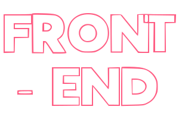
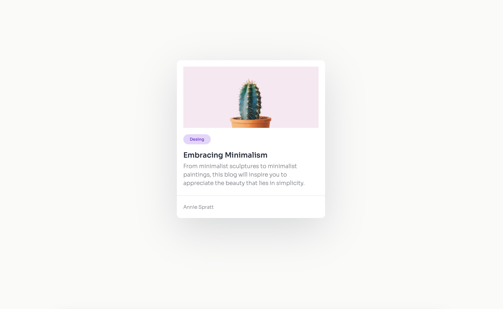

  <ul style='list-style-type: none; display: flex; justify-content: space-between;'>
    <li>
      
    </li>
    <li style='display: flex; flex-direction: column; justify-content: end; padding: 2rem; color: #fff;'>
      

        
CaessarCZX

        
Software Engineer

      

    </li>
  </ul>

## Overview

This project is a simple demonstration of how to create a minimalist card using HTML and CSS. This is a small component created without libraries or frameworks, after all anyone could need a fast and elegant card design for their web projects.

## Features

- Clean and minimalistic design.
- Responsive layout that looks great on all devices.
- Easy-to-understand HTML and CSS for beginners.
- Customizable colors and styles to fit your project.

You can see a live preview of the minimal card in action 👉🏼 [here](https://minimal-blog-card-caessarczx.netlify.app).

## Usage

1. Clone this repository to your local machine using `git clone`.
2. Open the `index.html` file in your preferred web browser.
3. Customize the card by modifying the HTML and CSS to fit your needs.

## Credits

This project is part of the first challenge from devChallenges.io [Enter to devChallenges here!](https://devchallenges.io).

## License

This project is licensed under the MIT License - see the [LICENSE](../LICENSE) file for details.

